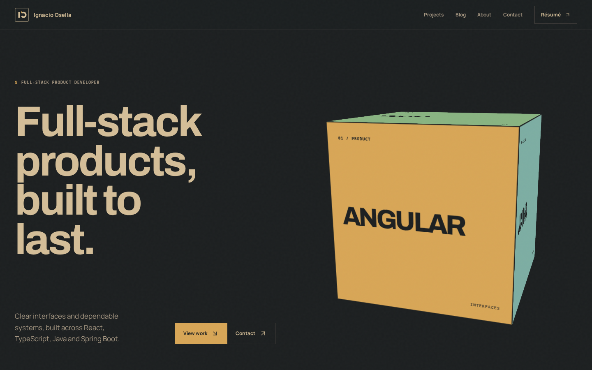

<p align="center">
  
</p>

<h1 align="center">Ignacio Osella · Portfolio</h1>

<p align="center">
  A premium, Markdown-first portfolio for a full-stack developer building thoughtful and maintainable digital products.
</p>

<p align="center">
  <a href="https://github.com/NachoOsella/portfolio">Repository</a>
  ·
  <a href="frontend/README.md">Frontend documentation</a>
</p>

<p align="center">
  
  
  
  
</p>



## Overview

This repository is the home of Ignacio Osella's personal portfolio and its Markdown-first content platform. The public experience presents selected projects, technical writing, professional context, and contact information through a restrained Gruvbox-inspired visual system.

The project is intentionally Markdown-first: projects, articles, and static pages are authored as files, validated through frontmatter schemas, and rendered consistently across the public site and the private Studio workspace.

> [!NOTE]
> The Spring Boot backend stores Markdown in the local `frontend/content` directory mounted into Docker. It validates local files and uses the GitHub Contents API only for explicit backup pushes. Users are configured with bcrypt hashes in environment variables.

## What is included

### Public portfolio

- Responsive home page with kinetic typography and pointer-reactive geometry.
- Project index and detailed project stories with system diagrams.
- Technical writing index and article pages.
- About and contact experiences.
- Responsive layouts with reduced-motion support and accessible interaction states.

### Private Studio

The `/admin` workspace is a browser-based content-management prototype for:

- Creating and editing projects, posts, and pages.
- Previewing Markdown and validating YAML frontmatter.
- Importing and exporting content files.
- Managing drafts and local persistence when the API is disabled.
- Reviewing local content changes and pushing selected Markdown changes to GitHub when the API is enabled.
- Handling messages, settings, and protected routes.

> [!WARNING]
> Keep `GITHUB_TOKEN` and `APP_AUTH_USERS` on the backend only. The browser never receives repository credentials or password hashes.

## Technology

- React 19 and TypeScript
- Vite 7 and pnpm
- Spring Boot 3.4, Java 21, and GitHub Contents API
- Docker Compose and Caddy
- Tailwind CSS 4 with a custom design system
- React Router and TanStack Query
- Motion for React
- React Hook Form and Zod
- React Markdown, remark-gfm, rehype-highlight, and YAML
- Vitest, jsdom, and React Testing Library

## Project structure

```text
.
├── frontend/                 # React/Vite application
│   ├── content/              # Markdown pages, posts, and projects
│   ├── public/               # Static assets and favicon
│   ├── src/
│   │   ├── app/              # Metadata and route configuration
│   │   ├── components/       # Public, editor, and UI components
│   │   ├── layouts/          # Public and protected layouts
│   │   ├── repositories/     # Repository interfaces, API adapters, and mock fallback
│   │   ├── schemas/          # Frontmatter validation schemas
│   │   ├── services/         # Drafts, downloads, and persistence
│   │   └── styles/            # Public and Studio visual systems
│   └── package.json
├── backend/                  # Spring Boot API and GitHub integration
├── docker/                   # Dockerfiles and Compose configuration
└── README.md
```

## Getting started

### Requirements

- Node.js 20 or newer
- pnpm 10 or newer

### Install and run

```bash
cd frontend
pnpm install
cp .env.example .env
pnpm dev
```

The development server runs on Vite's default port. Open the local URL printed in the terminal to explore the public site.

### Available commands

Run these commands from `frontend/`:

```bash
pnpm dev          # Start the development server
pnpm build        # Type-check and build for production
pnpm preview      # Preview the production build
pnpm lint         # Run ESLint
pnpm format       # Format the source tree with Prettier
pnpm test         # Run the test suite once
pnpm test:watch   # Run tests in watch mode
```

### Run the backend

Configure `backend/.env` from [`backend/.env.example`](backend/.env.example), then start the API:

```bash
cd backend
mvn test
set -a && . ./.env && set +a
mvn spring-boot:run
```

Start the frontend with `VITE_API_URL=http://localhost:8080/api` to use the backend's local Markdown content. GitHub is used only for explicit backup pushes.

## Content model

Content lives in `frontend/content/` and uses Markdown with YAML frontmatter.

```text
content/
├── pages/       # Static pages such as About and Now
├── posts/       # Technical articles
└── projects/    # Portfolio case studies
```

Example project metadata:

```md
---
title: Modular ERP Platform
slug: modular-erp
description: A reusable ERP foundation for small and medium businesses.
status: published
featured: true
projectType: Full-stack application
technologies:
  - React
  - TypeScript
  - Spring Boot
updatedAt: 2026-07-28
---

# Overview

The project story starts here.
```

The frontend preserves unknown frontmatter fields when known metadata is edited. Draft, archived, and scheduled posts are kept out of public routes according to their status.

## Routes

| Area | Routes |
| --- | --- |
| Public | `/`, `/projects`, `/projects/:slug`, `/blog`, `/blog/:slug`, `/about`, `/contact` |
| Studio | `/admin`, `/admin/content`, `/admin/projects`, `/admin/posts`, `/admin/pages`, `/admin/files`, `/admin/git`, `/admin/messages`, `/admin/settings` |

## Architecture

Content stays in local Markdown files mounted into the backend. The API is the only component allowed to authenticate users or write local content; GitHub is an optional backup destination:

```text
React frontend
      │ REST API + HttpOnly cookie
      ▼
Spring Boot backend
      │ local filesystem
      ▼
frontend/content/*.md
      │ explicit Studio push
      ▼
GitHub backup
```

`frontend/src/repositories/` contains API adapters with a local mock fallback. See [`backend/README.md`](backend/README.md) for setup, environment variables, security behavior, and endpoints.

## Environment

Copy `frontend/.env.example` to `frontend/.env`:

```env
VITE_API_URL=http://localhost:8080/api
```

When `VITE_API_URL` is set, the frontend calls the Spring Boot API, which reads the local Markdown directory. Remove it to run the local mock fallback.

## Design direction

The public interface follows a technical editorial system built around:

- Gruvbox Material Dark Hard neutrals.
- Warm typography with Archivo for display and Manrope for body copy.
- One-pixel rules, square controls, and angular geometry.
- Motion that clarifies hierarchy instead of competing with content.
- Semantic project colors used as full visual fields rather than decorative badges.

The visual system is documented in [`frontend/DESIGN.md`](frontend/DESIGN.md), and the product intent is documented in [`frontend/PRODUCT.md`](frontend/PRODUCT.md).

## Project status

The public portfolio, API-backed Studio adapters, and Spring Boot GitHub backend are implemented. Docker Compose is set up for local use ([`docker-compose.yml`](docker-compose.yml)) and for Dokploy ([`docker-compose.dokploy.yml`](docker-compose.dokploy.yml), see [docker/README.md](docker/README.md)).
